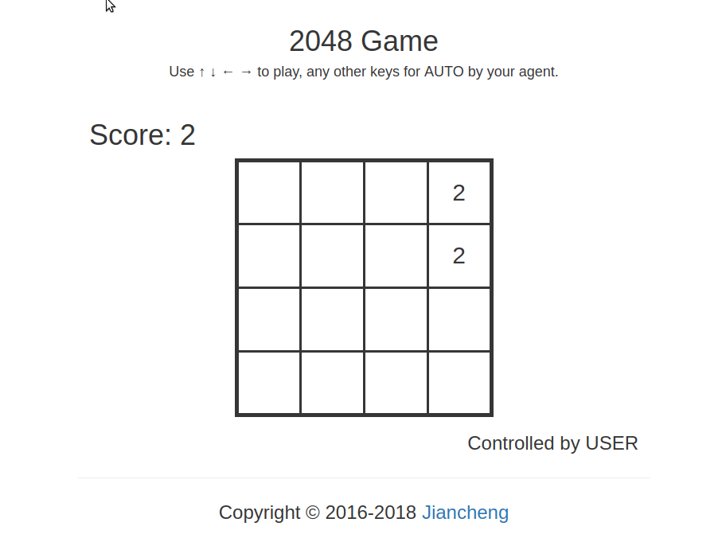

# 2048-api
A 2048 game api for training supervised learning (imitation learning) or reinforcement learning agents

# To compile the pre-defined [ExpectiMax](https://github.com/nneonneo/2048-ai) agent

```bash
cd game2048/expectimax
bash configure
make
```

# To run the webapp
```bash
python webapp.py
```



